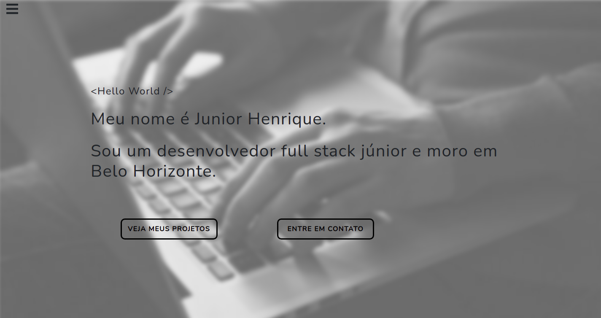
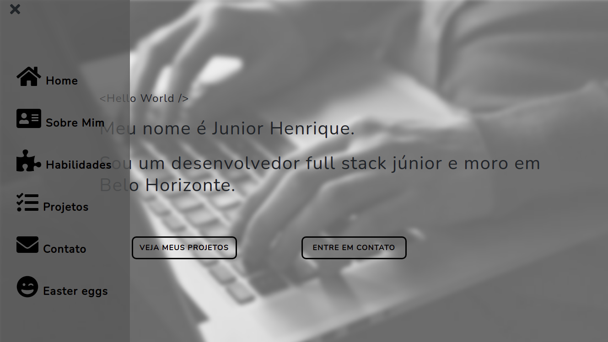

# Portfólio


**Imagem Tela Inicial**



**Imagem Tela Inicial Menu**



-------------------------------------------


## Descrição 

Projeto desenvolvido com a finalidade de mostrar meus conhecimentos e projetos desenvolvidos.

- Publicado com GhPages e GitHub Pages

- No canto superior esquerdo se encontra o menu de navegação.

- Dois buttons direcionados para projetos e para entrar em contato comigo!

- Navegue com moderação

- **[LINK DO PROJETO](https://junior030.github.io/portfolio/)**

---------------------------------------------

## Linguagens e ferramentas usadas

  
  
  
  
  
  

## Download

```
git clone https://github.com/Junior030/portfolio.git

npm install

npm start

```
Desenvolvido por JUNIOR HENRIQUE DE FARIA
